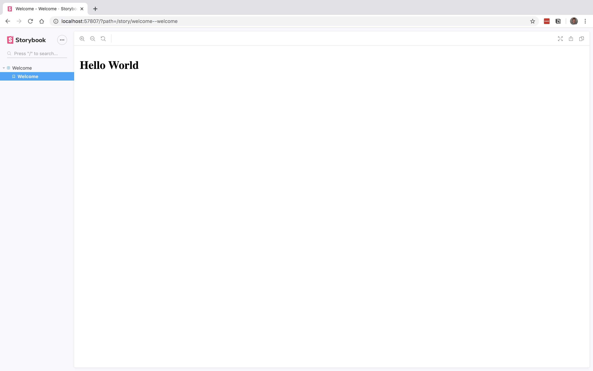
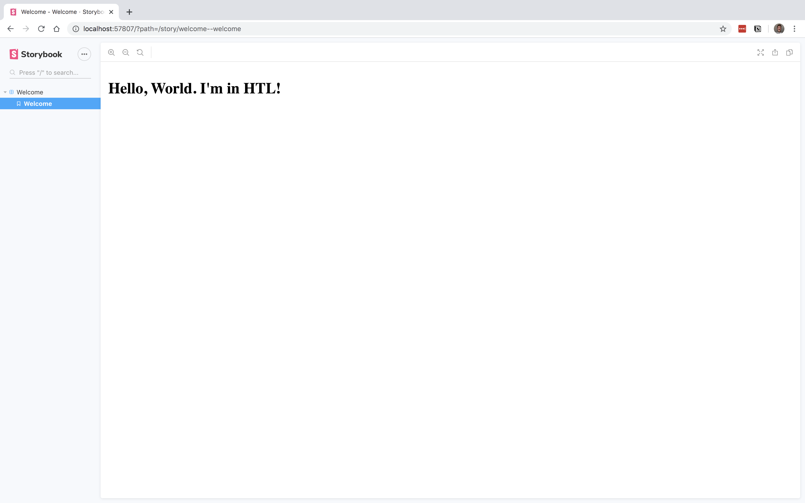

# The fastest way to start learning HTL: @storybook/aem

Repository: https://github.com/jzeltman/aem-fed/tree/master/001
Tags: AEM, Beginner, HTL

Getting started with AEM and HTL generally means setting up a local AEM instance. For many frontend developers, this can be a bit daunting. So let's start with something more familiar - an NPM Package: @storybook/aem.

Storybook is changing the way we develop by providing a best-in-class workbench for creating components. @storybook/aem is the fastest way to begin writing HTL code, as it uses the JavaScript based HTL Engine in conjunction with Storybook.

Let's begin by setting up our folder structure and some initial files:

    # Create our project folder
    mkdir aem-fed-001
    # Change Directory into our project folder
    cd aem-fed-001
    # Create our .storybook folder, main.js and preview.js files
    mkdir .storybook && touch .storybook/main.js .storybook/preview.js
    # Create our component directory, a welcome component, and it's files
    mkdir components components/welcome && touch components/welcome/welcome.html components/welcome/welcome.stories.js components/welcome/welcome.content.json

We need to create a package.json file using your favorite package manager:

    # For yarn users
    yarn init
    
    # For npm users
    npm init

Now that you've got your package.json created, let's install our dependencies:

    # yarn users
    yarn add @storybook/aem 
    
    # npm users
    npm install @storybook/aem

And we will need to add a script to our package.json to start Storybook:

    // package.json
    {
      "scripts": {
        "storybook": "start-storybook"
      }
    }

Now we will configure our Storybook main file to look for stories in the components folder:

    // .storybook/main.js
    module.exports = {
      stories: [`../components/**/*.stories.*`]
    };

Let's now add some markup to our template:

    <!-- components/welcome/welcome.html -->
    <h1>Hello World!</h1>

And now let's setup our first story:

    // components/welcome/welcome.stories.js
    import WelcomeHTML from './welcome.html';
    
    export default {
      title: 'Welcome'
    };
    
    export const Welcome = async () => {
      return {
        template: await WelcomeHTML
      }
    }

We can now startup Storybook

    # yarn users
    yarn storybook
    # npm users
    npm run storybook

Once successfully launched, a new browser window/tab will open with storybook, and you should see your Hello World!

Well this is nice and all, but I thought this was about learning HTL? Indeed it is, so let's move on to the HTL portion of things. For this tutorial, we will be leveraging the @storybook/aem's GenericModels to add some data to our template.

Let's update our .storybook/preview.js file to connect our data and template.

    // .storybook/preview.js
    import { addDecorator, aemMetadata, GenericModel } from '@storybook/aem';
    
    addDecorator(
      aemMetadata({
        models: {
          'Welcome': GenericModel
        }
      })
    );

Now we can add some data:

    // components/welcome/welcome.content.json
    {
      "name": "World. I'm in HTL!"
    }

Now that we have some data, we need to update our template file to use that data:

    <!-- components/welcome/welcome.html -->
    <sly data-sly-use.welcome="Welcome" />
    <h1>Hello, ${welcome.name}</h1>

And finally, we need to update our story file to use our content:

    import WelcomeHTL from './welcome.html';
    import WelcomeJSON from './welcome.content';
    
    export default {
      title: 'Welcome',
    };
    
    export const Welcome = async () => {
      return {
        content: WelcomeJSON,
        template: await WelcomeHTL
      }
    }

Now in your browser you should see something like this:

You've made your first HTL template! In the following posts, we will learn more about what we've made here and dive deeper into HTL and AEM Frontend Development.